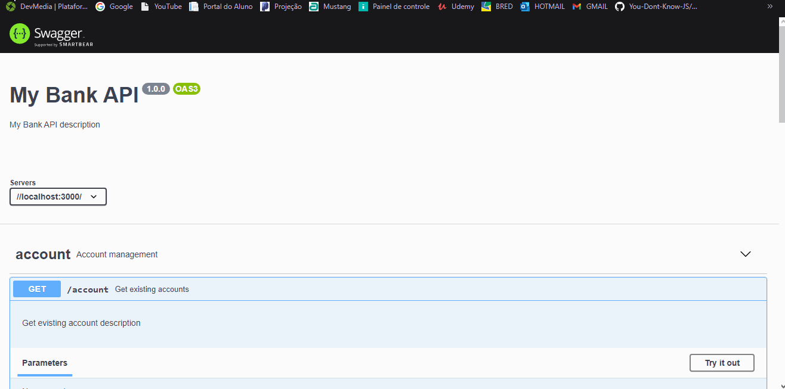

  <a href="#-tecnologias">Tecnologias</a>&nbsp;&nbsp;&nbsp;|&nbsp;&nbsp;&nbsp;
  <a href="#-projeto">Objetivo da API</a>&nbsp;&nbsp;&nbsp;|&nbsp;&nbsp;&nbsp;

 

## 🚀 Tecnologias

Essa API foi desenvolvido com as seguintes tecnologias:

- JavaScript
- Node.js
- Utilizando as bibliotecas: Express, Winston, File System,Cors e Swagger-Ui-Express.
  -Insomnia - para teste de Request HTTP.

## 🔖 Objetivo da API

Essa API tem como finalidade praticar o conteúdo que foi dado no Módulo 2 do Bootcamp da IGTI, como a utilização das bibliotecas citadas acima, tratamentos de erros, gravação de logs, validação de campos e como fazer documentação da API utilizando o site https://editor.swagger.io.

<h3><strong>Editado por Bryan</strong><h3>

